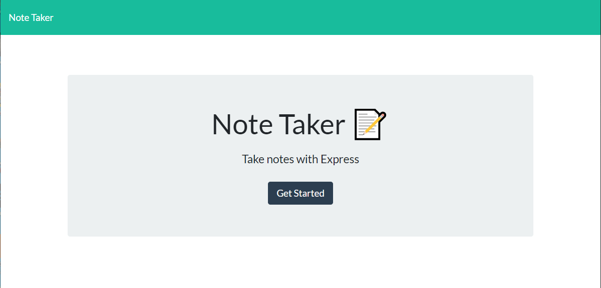
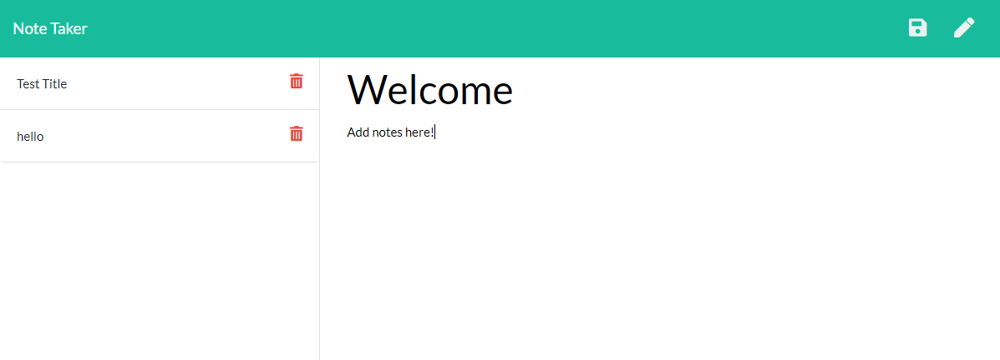

# Notepad

## Descriptions

This application allows the user to write and save notes. This application utilizes front-end features to take user input and back-end features to save and retrieve data. This application also utilizes heroku to host the website and link will be provided at the end of this readme.

## Table of Contents

- [Installation](#installation)
- [Usage](#usage)
- [License](#license)
- [Credits](#contributing)
- [Tests](#tests)
- [Questions](#questions)

## Installation

The user needs to install: node, express and uniqid.

## Usage

## License

This application is covered by the Creative Commons license.

## Contributing

There were no collaborators for this project.

## Tests

There are no tests for this project.

## Questions

If you have any questions please send an email to: ldelgadothethird@gmail.com or go to github at: https://github.com/ldelgadoIII

## Links

https://notepad-21.herokuapp.com/
